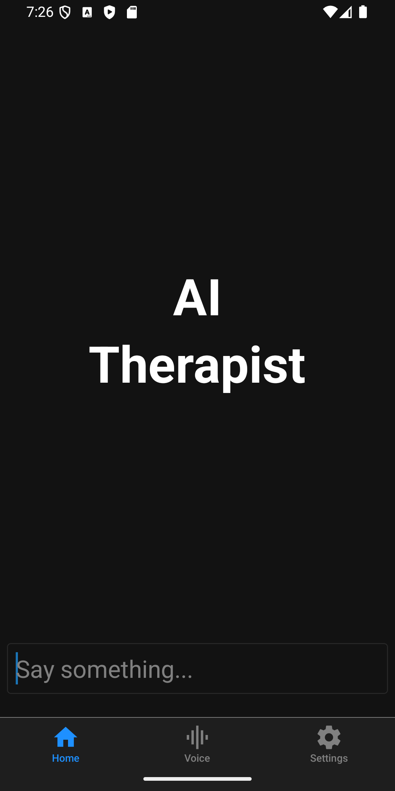
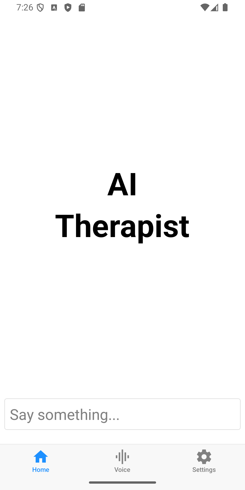
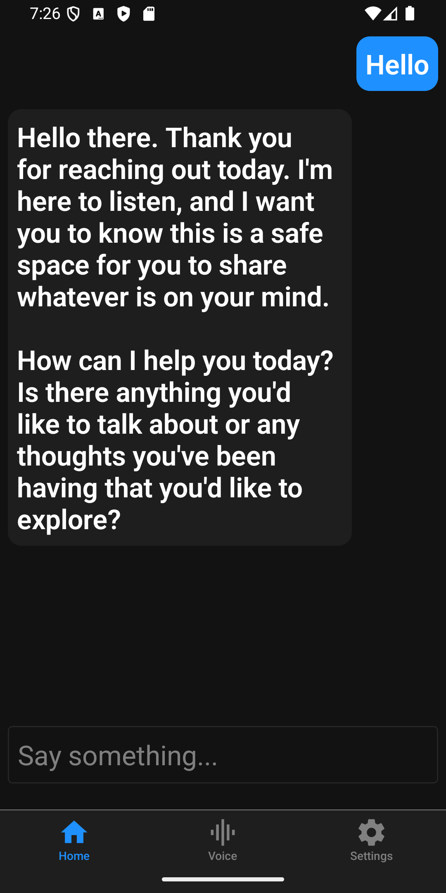
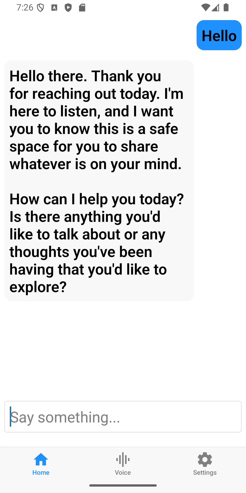
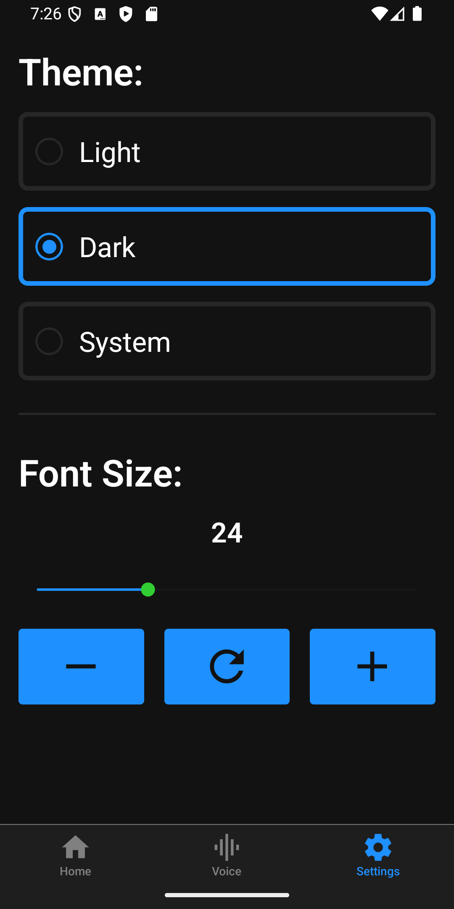
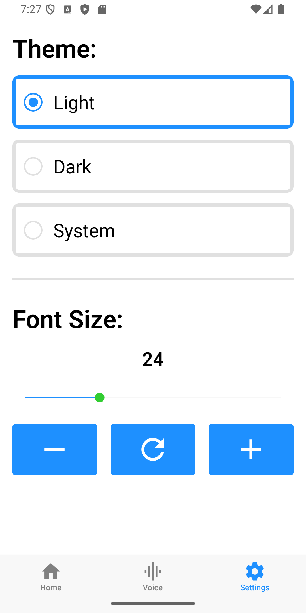

# React Native AI Therapist:

AI Therapist with React Native













# How to run:

- In the `next-app` folder, create a file called `.env.local`
- In this file, add this variable:

```bash
GOOGLE_GENERATIVE_AI_API_KEY=<your_google_api_key>
```

- Run the next app

```bash
cd next-app
npm run dev
```

- In another app, while the next app is open, run the expo app:

```
cd expo-app
npm start
```
